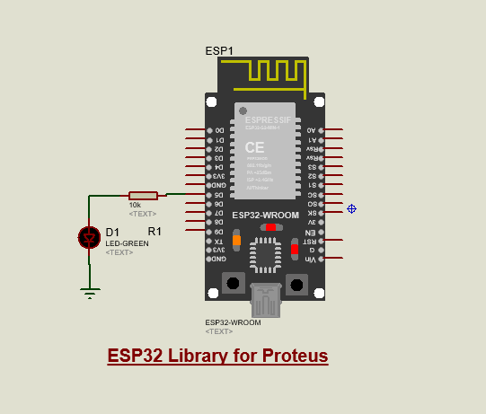

**Project Overview**

This project demonstrates integrating an ESP32 Arduino sketch with a Proteus simulation environment. It shows a simple LED example and provides guidance for running the sketch on real hardware or simulating it in Proteus using a compatible ESP32 model.

**Features**

- **Simple Demo:** LED blink/control example in `ESP32_LED/ESP32_LED.ino`.
- **Proteus Simulation:** A Proteus project (`ESP32 Simulation.pdsprj`) for visual simulation and testing.
- **Practical Workflow:** Tips for switching between simulation and real hardware development.

**Repository Layout**

- **`ESP32_LED/`**: Arduino sketch folder containing `ESP32_LED.ino`.
- **`ESP32 Simulation.pdsprj`**: Proteus project file for simulation.
- **`build/`**: Build artifacts (auto-generated by Arduino/IDE builds).

**Requirements**

- **Proteus**: Install Proteus (LabCenter) and ensure you have a compatible ESP32 simulation model/library. Some ESP32 models are provided by third-party Proteus libraries—check your Proteus library manager or vendor resources.
- **Arduino IDE or PlatformIO**: To edit, compile, and upload the sketch to physical ESP32 hardware.
- **ESP32 Board** (for real hardware testing): USB cable and drivers.

**Quick Start — Simulation (Proteus)**

1. Open `ESP32 Simulation.pdsprj` in Proteus.
2. Verify that the Proteus library includes a compatible ESP32 model. If the model is missing, obtain a compatible ESP32 simulation model (third-party or vendor-supplied) and add it to Proteus.
3. Load the compiled `.hex` or firmware for `ESP32_LED.ino` into the simulated ESP32 part, or use Proteus’ virtual programmer features if available.
4. Run the simulation and observe the LED behavior on the virtual board.

**Quick Start — Real Hardware**

- Open `ESP32_LED/ESP32_LED.ino` in the `Arduino IDE` or `VS Code` with the `PlatformIO` extension.
- Select the correct board (e.g., `ESP32 Dev Module`) and the correct serial port.
- Upload the sketch using the IDE GUI or PlatformIO command:

```powershell
# Build and upload (PlatformIO)
platformio run --target upload

# Or just use the Arduino IDE: open the sketch and click Upload
```

**Libraries & Components**

- Proteus includes many virtual instruments, parts, and standard libraries (resistors, LEDs, logic probes, oscilloscopes, etc.) that make it useful for prototyping and testing embedded projects.
- For advanced ESP32 peripherals, double-check that the Proteus model supports the specific peripheral or use a hardware-in-the-loop approach when necessary.

**Notes & Tips**

- Simulation fidelity depends on the availability and accuracy of the ESP32 model in Proteus. Some behavior (timing, Wi-Fi, Bluetooth) may not be fully modeled—use real hardware for final validation.
- Keep your Arduino/PlatformIO toolchain updated to avoid compilation mismatches.
- If you add or use third-party Proteus libraries, document them here so others can reproduce your setup.

**Contributing**

- Feel free to open issues or pull requests to improve the sketch, add simulation scripts, or include notes about Proteus libraries that worked for you.

**License & Contact**

- **License:** This project is licensed under the [MIT License](LICENSE).
- **Contact:** For questions or support, open an issue.

---
